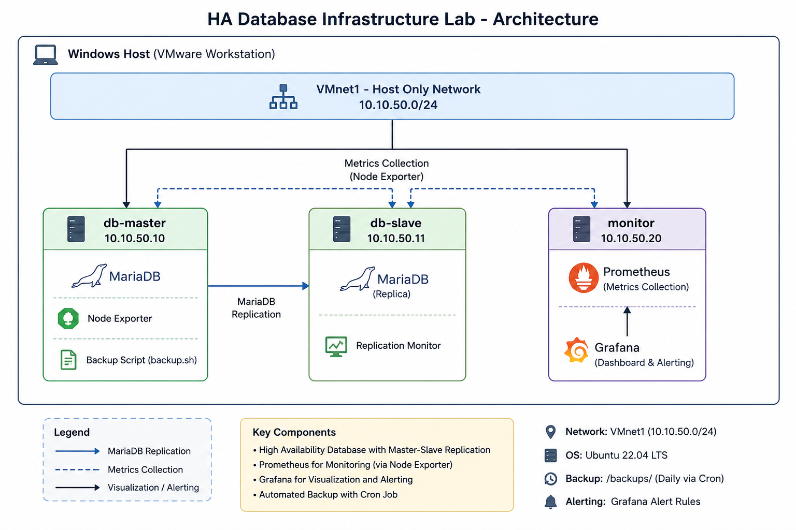
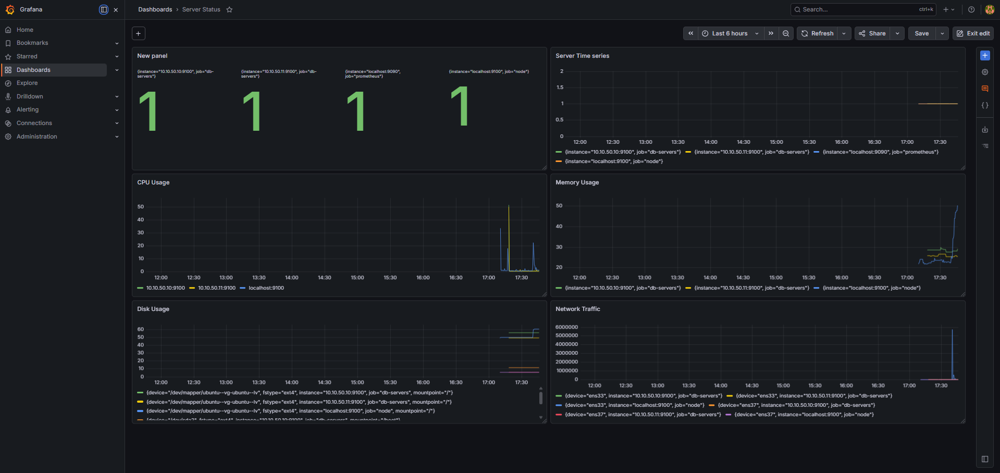
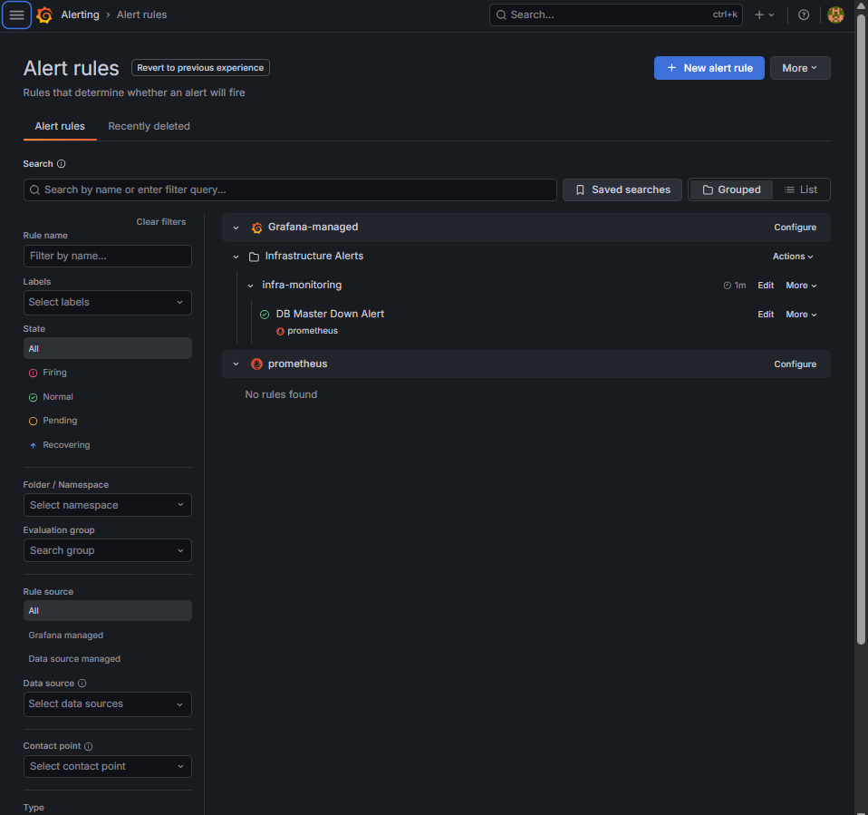
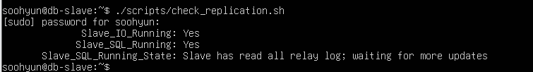
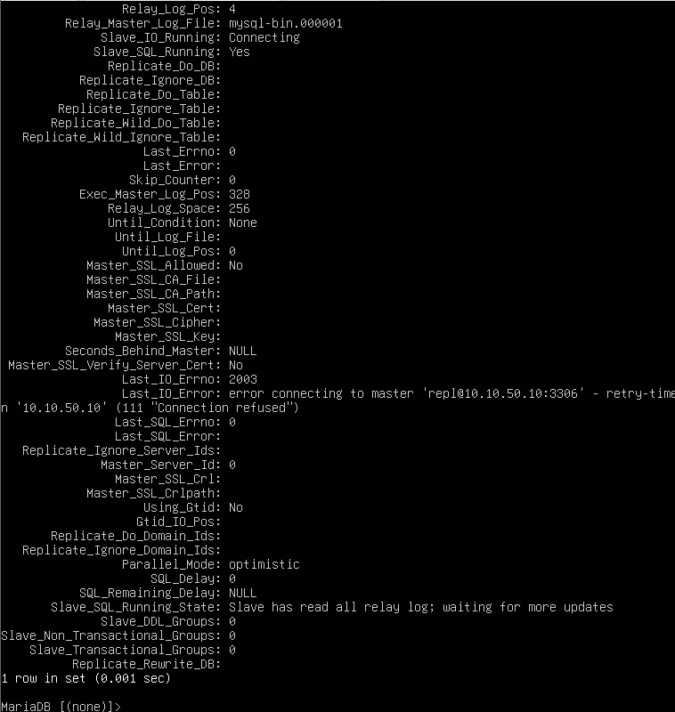
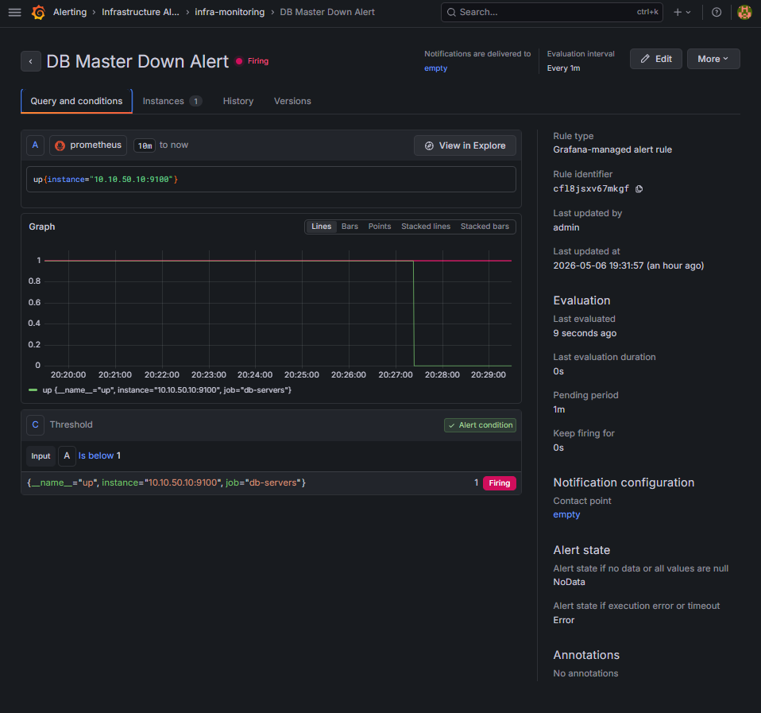
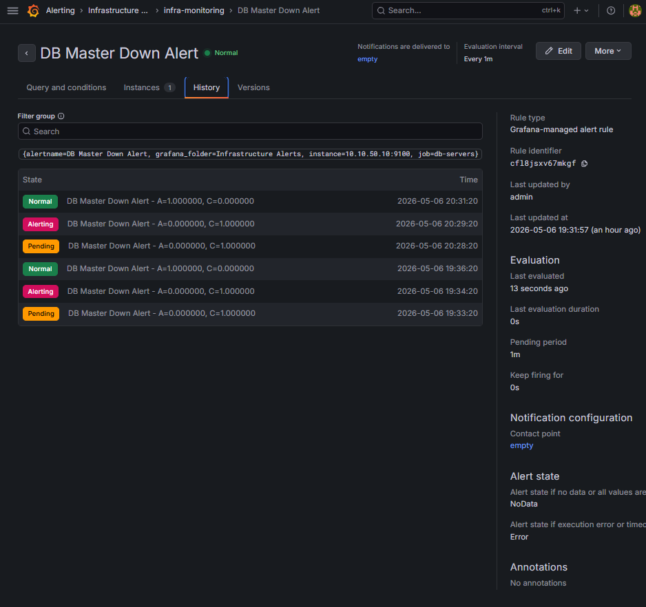
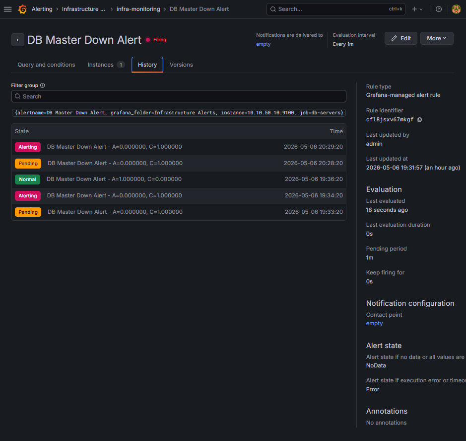

# HA Database Infrastructure

High Availability Database Infrastructure project built with MariaDB replication, Prometheus monitoring, and Grafana alerting.

This lab environment simulates a small-scale enterprise infrastructure with monitoring, backup automation, failover testing, and internal virtual network configuration using VMware.

---

# Architecture

- Router (NAT / Internal Routing)
- DB Master Server (Write Node)
- DB Slave Server (Read Replica)
- Monitoring Server (Prometheus & Grafana)

## Architecture Diagram



---

# Features

- MariaDB Master-Slave Replication
- Prometheus Infrastructure Monitoring
- Grafana Dashboard Visualization
- Grafana Alert Rule Management
- Automated Database Backup
- Cron-based Backup Scheduling
- Replication Health Check Script
- Infrastructure Failover Testing
- Internal Network Configuration using VMware
- Infrastructure Automation with Shell Scripts

---

# Monitoring Dashboard

Prometheus and Grafana were integrated to provide real-time infrastructure monitoring and alerting.

## Monitoring Metrics

- CPU Usage
- Memory Usage
- Disk Usage
- Network Traffic
- Database Server Availability
- Infrastructure Health Status

## Dashboard Preview



## Alert Rules



---

# Replication Configuration

MariaDB replication was configured between the master and slave database servers.

## Replication Status

- Master-Slave replication configured successfully
- Real-time synchronization verified
- Internal network communication confirmed
- Replication health monitoring implemented

## Replication Healthy State



## Replication Failure State



---

# Infrastructure Alerting

Grafana alert rules were configured to detect infrastructure failures automatically.

## Alert Scenario

The monitoring system detects server failure when the monitored node becomes unavailable.

### Alert Workflow

1. Stop Node Exporter service on db-master
2. Prometheus detects unavailable target
3. Grafana alert enters Pending state
4. Alert transitions to Firing state
5. Service recovery restores Normal state

---

## Alert Firing State



## Alert History



## Alert Recovery



---

# Infrastructure Automation

## Automated Backup

Database backup automation was implemented using Bash shell scripts and cron scheduling.

### Backup Features

- Automated MariaDB backup
- Cron-based scheduled execution
- Backup verification testing
- Script-based infrastructure management

---

## Replication Health Check Script

A custom health check script was created to verify replication status automatically.

### Health Check Features

- Slave_IO_Running verification
- Slave_SQL_Running verification
- Replication state monitoring
- Infrastructure validation support

---

# Technologies

- Ubuntu Server 24.04
- MariaDB
- Prometheus
- Grafana
- VMware Workstation
- Bash Shell Scripting
- Linux Networking

---

# Project Structure

```text
ha-database-infrastructure-lab/
├── database/
├── docs/
│   ├── screenshots/
│   │   ├── alert-firing.png
│   │   ├── alert-history-detail.png
│   │   ├── alert-recovered.png
│   │   ├── grafana-dashboard-alert-rules.png
│   │   ├── grafana-dashboard-full.png
│   │   ├── host-network-info.png
│   │   ├── replication-failed.png
│   │   └── replication-normal.png
│   ├── architecture-diagram.png
│   ├── alerting.md
│   ├── backup-automation.md
│   ├── backup-restore.md
│   ├── cron-backup.md
│   ├── failover-test.md
│   ├── master-setup.md
│   ├── monitoring-setup.md
│   ├── replication-test.md
│   └── slave-setup.md
├── monitoring/
├── scripts/
└── vmware/
